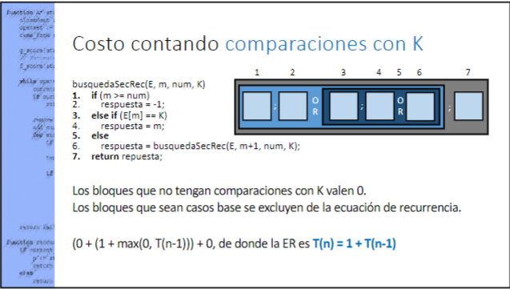

## Diseño de algoritmos

### Divide y conquistaras

__Ecuaciones de recurrencia__

Define una funcion sobre los numeros naturales, en terminos de su propio valor con uno o mas enteros menores que n

Surgen en forma natural caundo se desea expresar lo recursos empleados por procediminetos recursivos

" Como se comporta una operacion recursiva"

n es el tamaño del problema original

El lado izquierda de la ER será T(n), numero de opoeraciones basicas relaizadas con la entrada n

para estimar el lado derecho sera precisoestimar el costo de los diversos bloques del procedimiento, en funcion de n

Para una suceción de bloques, sumamos lso costos individuales

para una alternancia de bloques, en la que ninguna alternativa es un caso base, usamos el maximo de alternativas

Si un bloque contienen una invocacion de subrutina, determinamos el tamaño de sus parámetros

 Ecuacions de Recurrencia general:

 $T(n)= a T(\frac{n}{b}) + f(n) $

"a" se le llama "factor de ramificacón"

